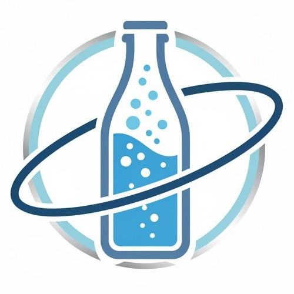
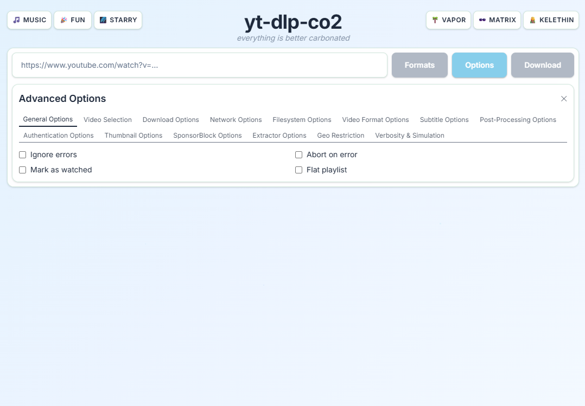
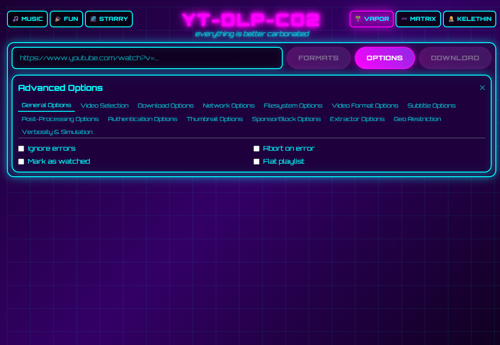
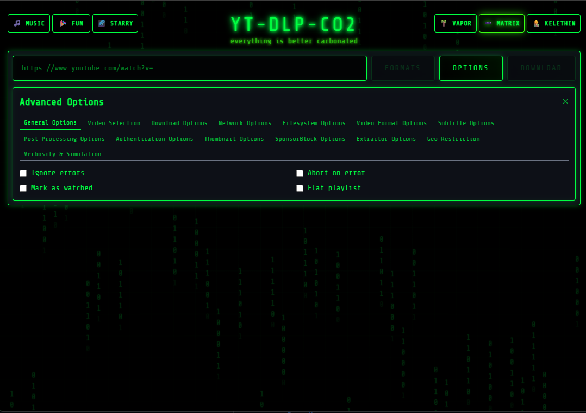
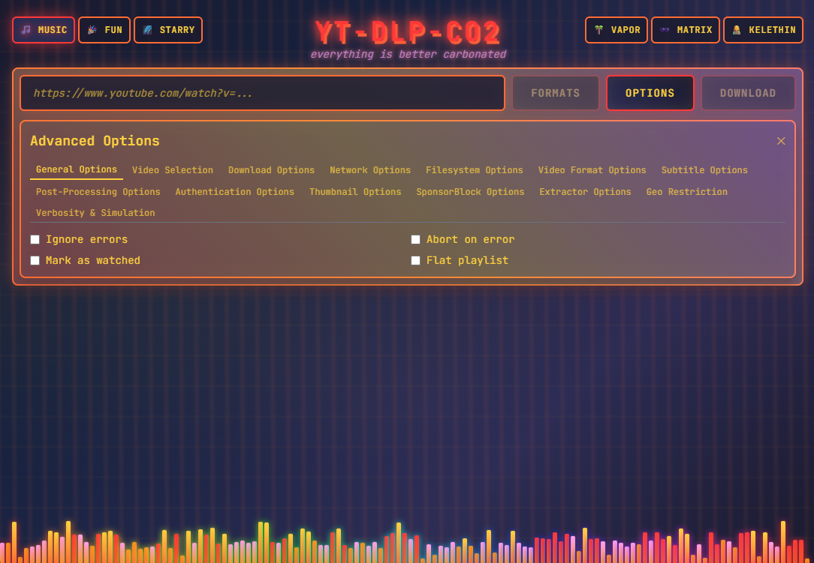
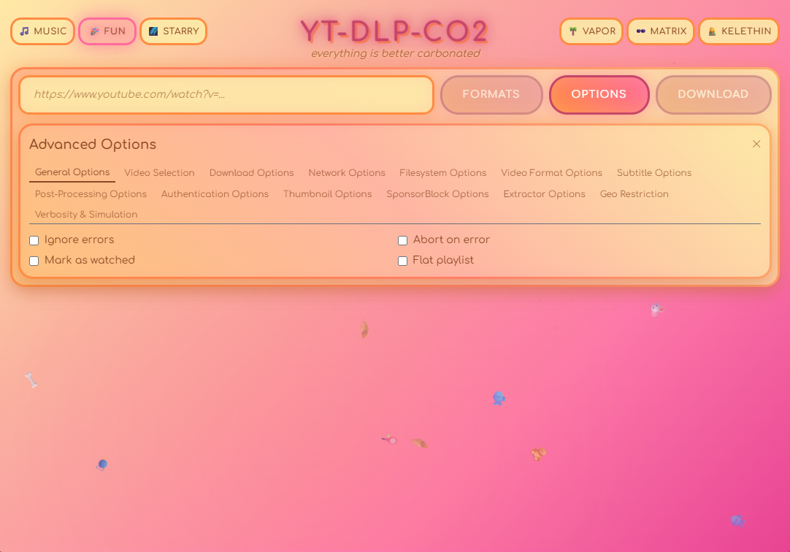
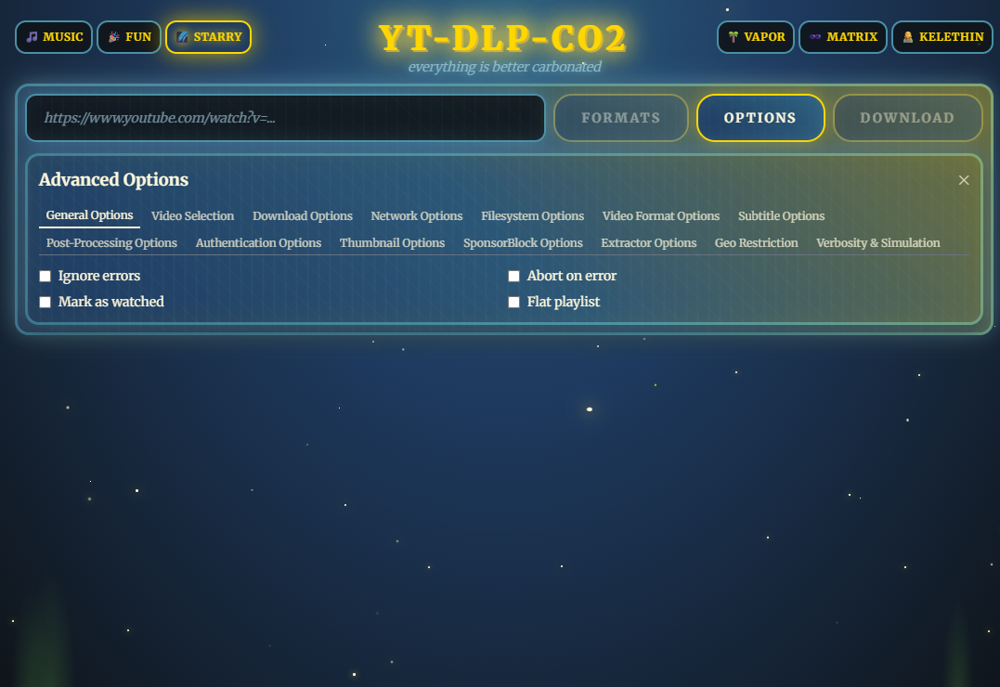
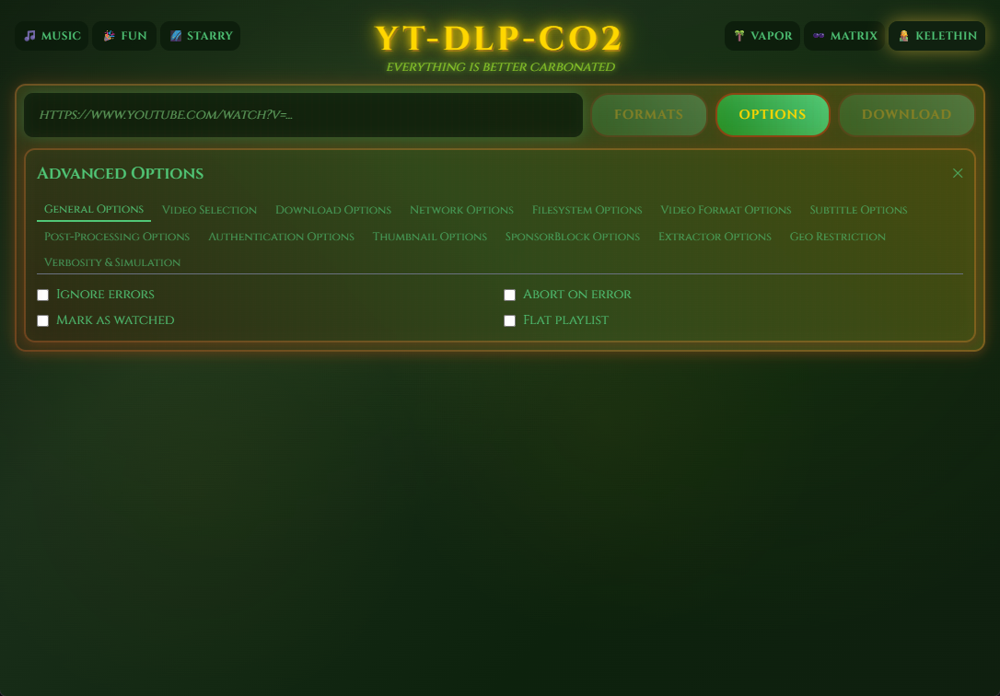

<div align="center">


<br>

# yt-dlp-co₂ from carbonatedWater.org

It's a modern web interface for yt-dlp with real-time progress tracking and multiple pretty cool themes, from the DEFINITIVE, OFFICIAL, WORLDWIDE provider of Carbonated Water rankings, carbonatedWater.org.
</div>

## Quick Start
```bash
# Navigate to the directory that you want the downloads folder placed at.
docker run -d -p 8000:8000 -v ./downloads:/app/downloads carbonatedwaterorg/yt-dlp-co2
sudo chown -R $USER:$USER ./downloads
# Open http://localhost:8000 and begin downloading
```

## Features

- **It uses yt-dlp** which is really great
- **It has all the options** that yt-dlp has pretty much
- **Real-time download progress** via WebSocket
- **7 stunning visual themes** (Carbonation, Vaporwave, Matrix, Music, Fun, Starry Night, Kelethin)
- **Format selection** with quality preview
- **150+ comprehensive options** - Every yt-dlp CLI option accessible through intuitive web interface
- **Advanced post-processing** - Audio extraction, subtitle embedding, thumbnail handling
- **Keeping it Python** pretty much for all of it

## Themes

It has a few good ones.

<div align="center">

| 🫧 **Default** | 🌴 **Vaporwave** | 🕶️ **Matrix** | 🎵 **Music** |
|:---:|:---:|:---:|:---:|
| <a href="assets/themeshots/1.png"></a> | <a href="assets/themeshots/5.png"></a> | <a href="assets/themeshots/6.png"></a> | <a href="assets/themeshots/4.png"></a> |
| *It's carbonated water* | *This word was written on something* | *Not like the movie* | *It feels like music* |

| 🎉 **Fun** | 🌌 **Starry Night** | 🧝 **Kelethin** |
|:---:|:---:|:---:|
| <a href="assets/themeshots/3.png"></a> | <a href="assets/themeshots/2.png"></a> | <a href="assets/themeshots/7.png"></a> |
| *How it feels* | *How it sounds* | *WTB Fungi and FBSS* |

</div>

## Building and Using

```bash
# Clone the repository to your current directory
git clone https://github.com/carbonatedWaterOrg/yt-dlp-co2.git .

# Docker Compose (recommended)
docker-compose up -d
sudo chown -R $USER:$USER ./downloads

# Docker
docker build -t yt-dlp-co2 .
docker run -d -p 8000:8000 -v ./downloads:/app/downloads yt-dlp-co2
sudo chown -R $USER:$USER ./downloads

# Local development  
pip install -r requirements.txt
uvicorn app.main:app --reload --port 8000
```

Access at http://localhost:8000

## Architecture

- **Backend**: FastAPI + yt-dlp library integration
- **Frontend**: HTMX + Alpine.js + TailwindCSS
- **Container**: Python 3.13 Alpine
- **Downloads**: Mounted to `./downloads/`

## Usage

1. Paste video URL
2. Click "Formats" to see available quality options  
3. Click "Options" to access 150+ advanced yt-dlp settings
4. Configure downloads with playlist controls, subtitle options, audio extraction, and more
5. Select format or click "Download" for best quality
6. Monitor progress in real-time
7. Switch themes using header buttons

**Recommendations**: We put this behind a reverse proxy on the same Docker host. We like Caddy.

### Advanced Options

Access every yt-dlp feature through organized categories:
- **Video Selection**: Playlist items, date filters, view count limits
- **Post-Processing**: Audio extraction, format conversion, subtitle embedding  
- **Download Control**: Retry settings, rate limiting, concurrent fragments
- **Authentication**: Login credentials for private content
- **SponsorBlock**: Skip sponsor segments automatically
- **And much more**: Network settings, geo-bypass, filesystem options

**Use responsibly**: Only download content you have permission to access offline, such as your own uploads, Creative Commons content, or from platforms that explicitly allow downloads.

[GitHub Repo](https://github.com/carbonatedWaterOrg/yt-dlp-co2)

## Built With

[Python 3.13](https://www.python.org/) • [FastAPI](https://fastapi.tiangolo.com/) • [Uvicorn](https://www.uvicorn.org/) • [yt-dlp](https://github.com/yt-dlp/yt-dlp) • [HTMX](https://htmx.org/) • [Alpine.js](https://alpinejs.dev/) • [Tailwind CSS](https://tailwindcss.com/) • [Docker](https://www.docker.com/)